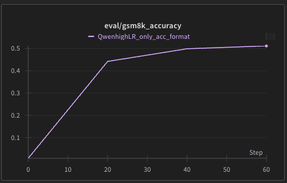
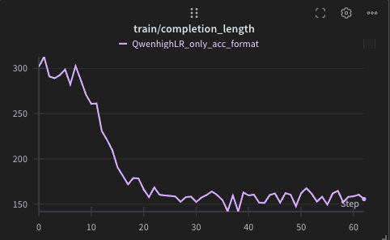

# R1 Style RLVR 

This contains experiments with [R1](https://arxiv.org/abs/2501.12948) style experiments with [Reinforcement Learning with Verifiable Rewards](https://arxiv.org/abs/2411.15124)

### Qwen Base Model
`main_base.py` finetunes the [Qwen 2.5 Base Model 0.5B](https://huggingface.co/Qwen/Qwen2.5-0.5B) on GSM8K. The official score of [Qwen 2.5 0.5B Instruct](https://huggingface.co/Qwen/Qwen2.5-0.5B-Instruct) is 41.6%. Finetuning purely using 2 rewards:
- Accuracy heavily weighted
- Format: Answer ends in <answer> tags and consists of some text before 

gives a score of ~51% which is a 10% improvement. 

To run, set `--nproc_per_node` and run: 

```bash
uv run torchrun --standalone --nproc_per_node=2 main_base.py --num_generations 16
```

<div align="center">
    
    <p style="font-size: small;"><em>Qwen Eval Curve</em></p>
</div>

##### Example Completions 
<div align="center">
    
    <p style="font-size: small;"><em>Completion length during training</em></p>
</div>
The system prompt is 

```
Assistant solves the user's question step by step before answering. Assistant answers using this response structure:
[detailed step by step reasoning process here]
<answer>
[Answer based on the reasoning above enclosed in <answer> tags]
</answer>

User: {prompt}
Assistant:
```

Example ccompletion after training:
```
 Let's think step by step:

1. John gets a loan worth 40% of his house, which is $250,000 * 0.40 = $100,000.
2. He uses 60% of that to pay off his debts, which is $100,000 * 0.60 = $60,000.
3. The amount leftover after paying off his debts is $100,000 - $60,000 = $40,000.

<answer>40000</answer>
```


### References 

This [Script](https://gist.github.com/willccbb/4676755236bb08cab5f4e54a0475d6fb).
The [OpenR1 Project](https://github.com/huggingface/open-r1/tree/main)
Thanks [Anton](https://x.com/abacaj) and [Will](https://x.com/willccbb) for the helpful discussions