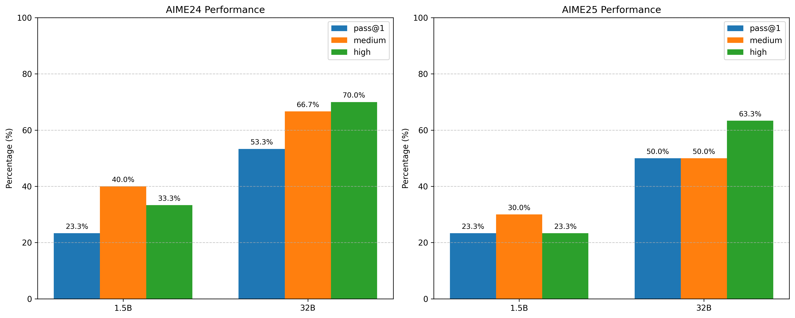
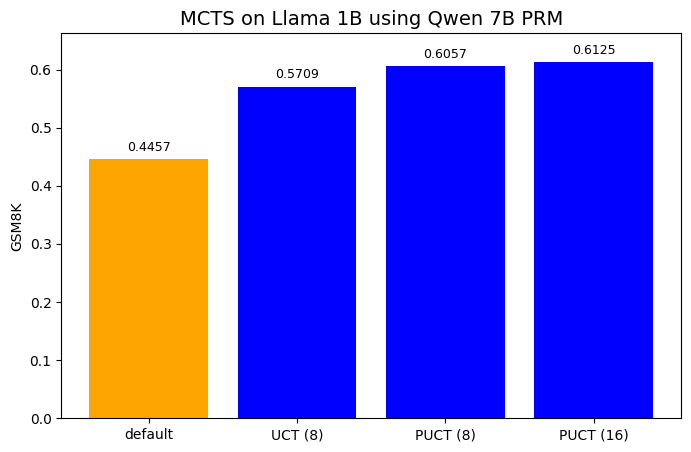

# Monte Carlo Tree Search 
## AIME
This experiment uses the distilled models from DeepSeek-R1 for MCTS together with [Qwen 7B](https://huggingface.co/Qwen/Qwen2.5-Math-PRM-7B) as a Process Reward Model for search. `mcts.py` contains the core MCTS logic.

PRM scores a node by using the minimum score. I found this to work the best which is surprising and different from the results from the [Qwen paper](https://arxiv.org/abs/2501.07301). The number in the bracket is the branching factor. 
- UCT is standard MCTS from games where the PRM scores the completion only at the end of the trajectory. So, $O(Branching Factor)$ number of invocations of the PRM.
- PUCT is from [AlphaZero](https://arxiv.org/abs/1712.01815) and uses the PRM to select children to expand. 

On the 1B model, performance almost doubles using MCTS. Note that the PRM is used only at the end of each generation. 

    
    
<em>AIME Results</em>

## Minimal
This experiment is [Llama 1B](https://huggingface.co/meta-llama/Llama-3.2-1B) using [Qwen 7B](https://huggingface.co/Qwen/Qwen2.5-Math-PRM-7B) as a Process Reward Model for search. 
There are only 2 scripts:
 - `main.py` is the core MCTS logic 
 - `eval.py` uses the [Evaluation Harness](https://github.com/EleutherAI/lm-evaluation-harness) to evaluate on GSM8K.

### Results 
The image below are the results on GSM8K. The performance gains is roughly 10%. 

    
    
<em>GSM8K Results</em>

